# Proyecto II: Diseño digital en HDL
### Jiahui Zhong Xie
### Ximena Araya Brenes 
## 1. Introducción
El proyecto consiste en la implementación del diseño sincrónico a través de una FPGA (Field Programmable Gate Array), en este caso la Tang Nano 9k, y HDL (Hardware Description Language) SystemVerilog. El sistema diseñado se trata de un teclado hexadecimal que recibe dos números enteros positivos de tres dígitos como máximo cada uno, los cuales se suman de manera interna y cuyo resultado es desplegado en un display de 7 segmentos. Además, se realizó un contador sincrónico y un cerrojo set-reset, mediante compuertas NAND, utilizando la señal de reloj de la FPGA cuyas formas de onda resultantes fueron observadas en un osciloscopio digital con puntas de tipo 10:1.
## 2. Objetivos
El problema principal por resolver es la implementación tanto física como lógica de un sumador simple de tres dígitos, 
mediante un teclado hezadecimal y un display de 7 segmentos, el cual opera a la frecuencia de reloj de la FPGA (27MHz). 
El objetivo principal es el desarrollo de un sistema digital utilizando Hardware Description Language. Los objetivos específicos consisten en implementar el circuito del diseño digial realizom, así como un testbench que permita controlar la lógica del circuito. Además, implementar una función de suma aritmética y una función de despliegue. Finalmente, mediar la salid de un analizador lógico sencillo y diseñar un cerrojo set-reset con compuertas NAND. 
## 3. Funcionamiento del circuito y subsistemas
El circuito de manera general, consiste en un teclado hexadecimal, un display de 7 segmentos de 4 dígitos de cátodo común, así como de elementos resistivos y transistores BJT de tipo NPN. En primer lugar, el teclado hexadecimal se encuentra conectado directamente a los pines de la FPGA, a excepción de las filas, las cuales cuentan con una resistencia de regulación. Posteriormente, el display se encuentra conectado a una resistencia que proteje a la FPGA antes de los pines, además, los pines encargados de controlar la activación de cada dígito son regulados a manera de "switch" mediante un transistor BJT. La lógica consiste en el escaneo del teclado matricial para determinar qué tecla fue presionar, luego una FSM (Finite State Machine) verifica el orden en el que fueron ingresados los dígitos, finalmente, se realiza la suma y se despliega. 
### 3.1 Subsistema de lectura del teclado mecánico hexadecimal
Este consiste en tres módulos, el primero realiza un "barrido" de las columnas y filas para determinar que teclas fueron presionadas, luego el debouncer se encarga de verificar que no se generen rebotes, es decir, que los pulsos sean correctos y finalmente, convierte las convierte a señales lógicas. 
### 3.2 Subsistema de suma aritmética de los datos
En este subsistema se reciben los dos números de tres dígitos en la FPGA y se realiza la suma de manera sincrónica con el reloj de 27 MHz, el resultado de 11 bits se almacena para ser convertido a formato BCD (binary coded decimal) para finalmente ser "enviado al subsistema de despliegue". 
### 3.3 Subsistema de despliegue de código decodificado en display de 7 segmentos
Este último se encarga de recibir los datos en formato BCD y mostrarlos en el display de 7 segmentos, para ello, en el primer módulo se indica que número debe mosstrarse, luego se decodifica para poder ser representado en los siete segmentos (a-g) de manera correspondiente, por último el multiplexor se encarga de activar un display a la vez. 
## 4. Diagrama de bloques 

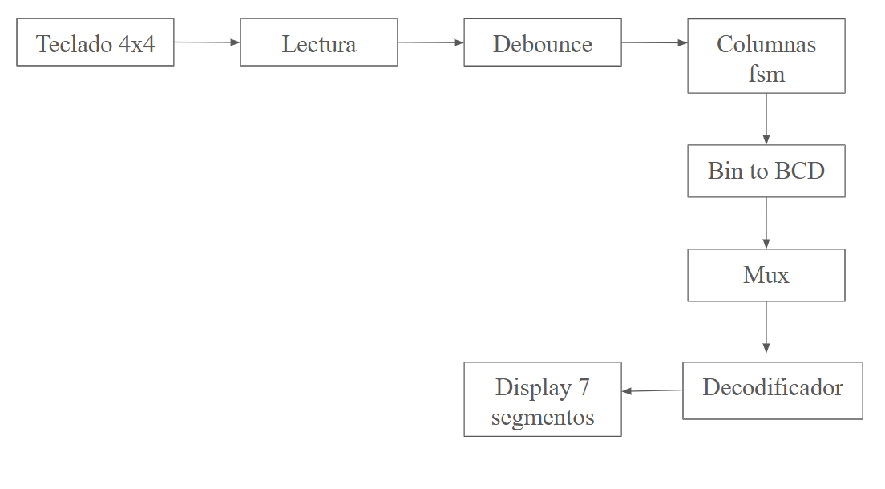

### 4.1 Teclado hexadecimal: 
Es el dispositivo que corresponde a la entrada del sistema, cuenta con cuatro filas conectadas a la FPGA y 4 columnas, la señal que genera es la tecla presionada. 
### 4.2 Lectura (Keypad Scanner)
"Barre" las teclas del teclado para leer que filas y columnas están encendidas y así determinar que número o función se está presionando. 
### 4.3 Debounce
Se encarga de eliminar todas aquellas señales inestables del teclado, para asegurar que cada tecla presionada se tome en cuenta una sola vez. 
### 4.4 Columnas (Finite State Machine) 
Su función es acomodar la lectura de los números y la salida, sus entradas son las señales del debounce. 
### 4.5 Binary to BCD
Como su nombre lo indica, este bloque es el encargado de convertir los valores binarios al formato BCD, por lo tanto sus salidas corresponden a: bcd_num1, bcd_num2 y bcd_sum. 
### 4.6 Mutiplexor
Filtra las señales que se muestran en el display, es decir, el primer número, el segundo número y el resultado 
### 4.7 Decodificador para el display
Este convierte los dígitos en formato BCD a los segmentos correspondientes en el display (a-g).
### 4.8 Display de 7 segmentos 
Muestra de manera física los números ingresados y la suma realizada. 
## 5. Diagramas de estado 

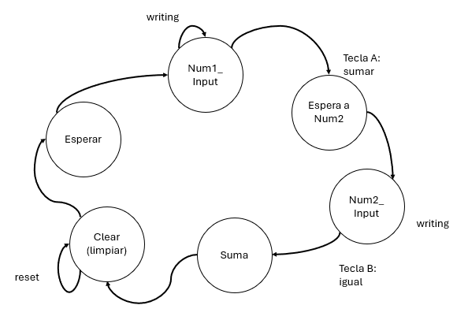

### 5.1 Esperar (IDLE)
Estado inicial en el que el sistema se encuentra en espera hasta que se presione una tecla. }
### 5.2 Num1 Input
Es el que ingresa el primer número y se guarda. 
### 5.3 Esperar a Num2 
Es el estado en el que se espera por el segundo número, una vez guardado el primero y se activa cuando se presiona el botón correspondiente a la función de suma. 
### 5.4 Num2 Input 
Guarda el segundo número hasta que se presiona la tecla correspondiente a la operación igual. 
### 5.5 Suma (Display Sum)
Muestra en el display el resultado de la suma. 
### 5.6 Clear (Limpiar)
Limpia y regresa al estado inicial (IDLE). 
## 6. Simulación funcional 
### 6.1 Ingreso de datos:
Para comenzar, se ingresa el primer número: 123, luego se presiona la tecla A para indicar la suma, se prosigue con ingresar el segundo número: 004 y finalmente e presiona la tecla B para realizar la operación igual. 
### 6.2 Proceso interno
Cada vez que se presiona el teclado se genera un pulso, luego de pasar por debounce. Se procede a la máquina de estados, luego se realiza la suma aritmética y se convierte a formato BCD y finalmente, se muestra el resultado en el display de 7 segmentos. 
### 6.3 Resultados 
Finalmente, se verifica que el debouncer funcione correctamente, así como las señales necesarias para mostrar el resultado en formato BCD: 0127. 
## 7. Velocidades máximas           
La FPGA utiliza correspnde a la Tang Nano 9k, por lo que, el sistema opera con una señal de reloj máxima de 27MHz, este límite esta definido para poder realizar las funciones de conversión de binario a BCD, así como el debounce, entre otros. 
## 8. Contador sincrónico 
Para la parte 4.1 del proyecto correspondiente se reliazó un contador sincrónico utilizando dos 74LS163 conectados en cascada. Se estudió el comportamiento de la señal RCO o Ripple Carry Output mediante un osciloscopio digital con puntas 10:1. El sincronizador conssite en un contador binario que aumenta su valor a medida que aumentan los pulsos de reloj y la salida de reloj permite formar contadores de más bits. En la siguiente imagen se muestran las formas de onda y frecuencias obtenidas en el oscilosocpio. 

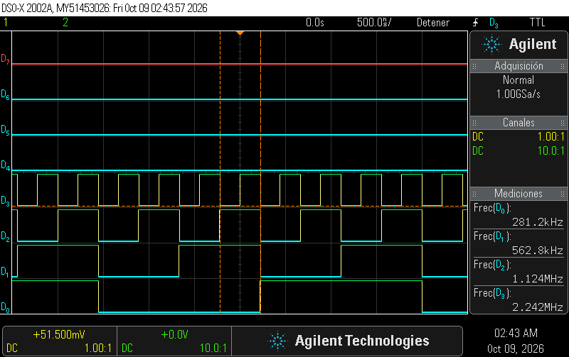

En esta se puede obsercar que cada salida tiene una frecuencia que coincide con la mitad de la señal anterior, lo cual verifica que el contador funciona correctamente. Además, no presenta glitches visibles o desfases considerables. La señal RCO se activa cuando el primer contador alcanza su máximo valor, mientras que las entradas definen qué tanto avanza el contador. 
La señan Rco indica que el contador alcanzó su valor máximo, cuando esta se activa el contador se desborda y activa ota etapa en cáscasda. La conexión menos significativa de la señal RCO corresponde al primero o el que cambia con más frecuencia, para coordinar el siguiente incremento del contador en cáscada. Por otro lado, la diferencia entre las entradas ENT y P es que aunque ambas son habilitadoras, P permite habilitar el conteo en "paralelo" mientras que ENT habilita en "cascada". Finalmente, según la hoja de datos investigadas el tiempo de propagación corresponde a 14ns, todos los flip-flops deben cambiar simultáneamente ante un el flanco, varía según cómo se llegue a la señal. 
## 9. Cerrojo set-reset 
Para la parte correspondiente al cerrojo set-reset se utilizó una compuerta NAND 74HC00. El cerrojo o latch funciona a través de la señal de reloj, es decir, CLK = 1. Las entradas de la NAND, como se observa en la imagen inferior, S y R están activas, y al habilitar la señal de reloj S fuerza un set y R fuerza un resent, las dos últimas NAND se encargan de guardar el estado. 

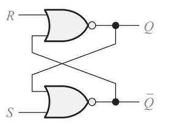

Su tabla de verdad corresponde a: 
| S | R | Q | Qn |
|---|---|---|----|
| 0 | 0 | 1 | 0  |
| 0 | 1 | 0 | 1  |
| 1 | 0 | 1 | 0  |
| 1 | 1 | 0 | 0  |

Si tanto S=1 como R=1 las entradas internas de las NAND se colocan en un estado de 0 de manera automática, lo que fuerza que ambas salidas sean igual a 1, por eso es que se evita utilizar. Además, este tipo de cerrojo se puede utilizar para guardar bits habilitados por niveles, realizar sistemas de debounce y control de niveles dentro de otros bloques. 
A continuación, se presentan los resultados obtenidos en el osciloscopio: 
Para S=1 y R=0: 

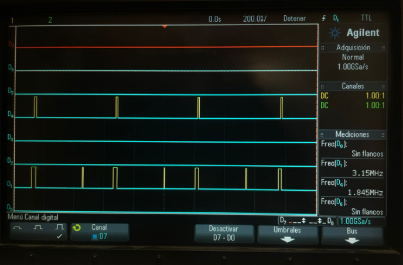

Para S=0 y R=1

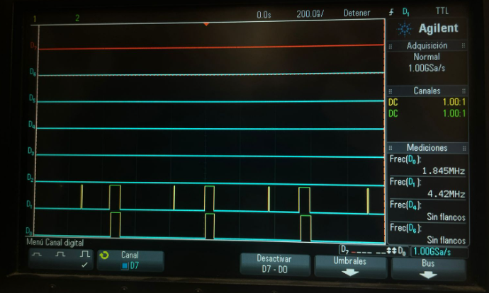

Para S=0 y R=0

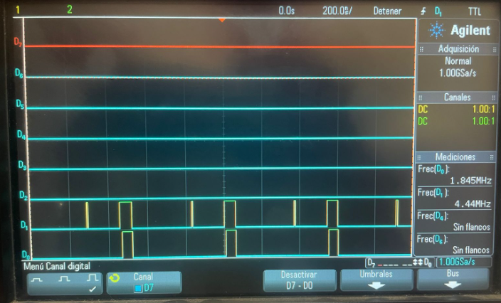

## 10. Problemas 
En cuanto a problemas encontrados, se encontraron dificultades con el cableado, ya que, las conexiones eran complicadas de montar sin la necesidad de utilizar jumpers. Inicialmente, algunos segementos no encendian del todo, por lo que, se decidió cambiarlos a un display diferente luego de revisar los constraints y asegurarse que estos fueran correctos. Además, algunas señales del teclado no se detectaban correctamente, por lo que, se utilizaron resistencias como métodos de control. Finalmente, un problema persistente en el circuito -incluso con cambio de display- consistió en que de manera general, los display encendían una luz muy tenue, no lo suficientemente brillante, sin embargo, se sospecha que puede ser un problema de conexión del banco de tensión en la FPGA. 
## 11. Bitácoras 
### Jiahui Zhong Xie 

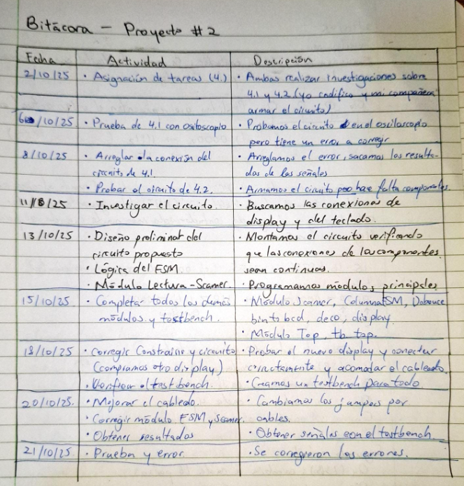

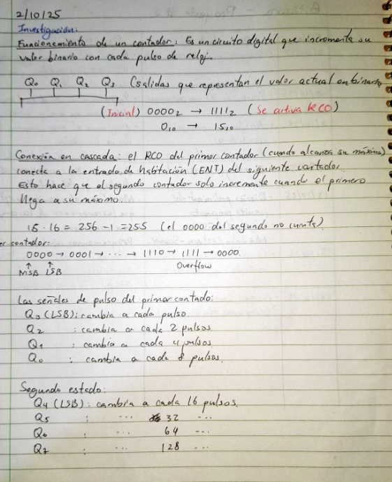

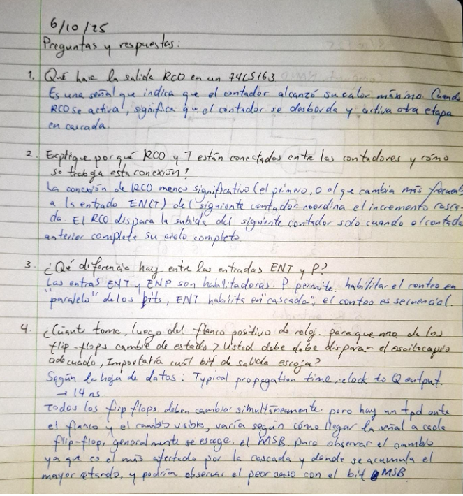

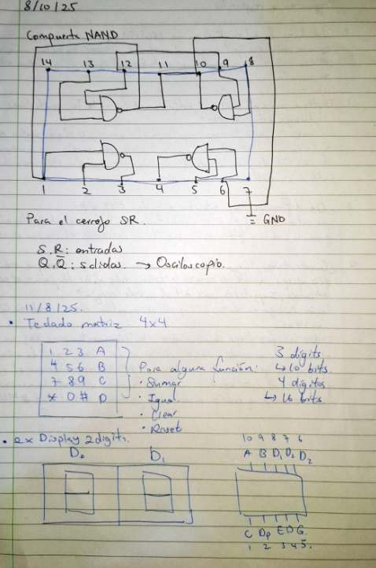

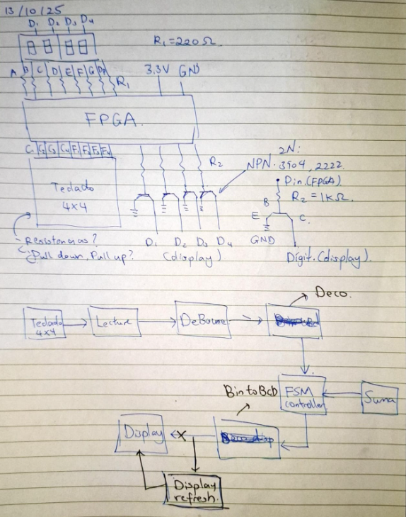

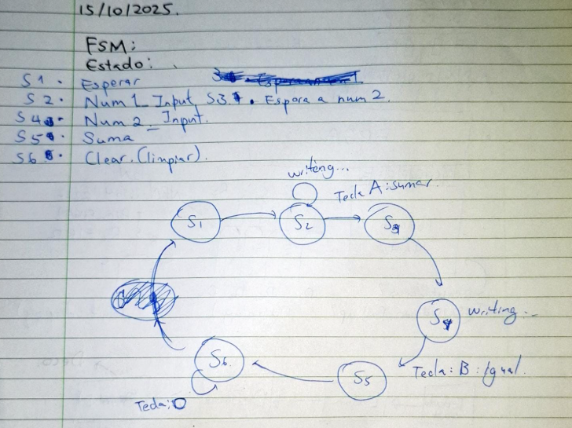

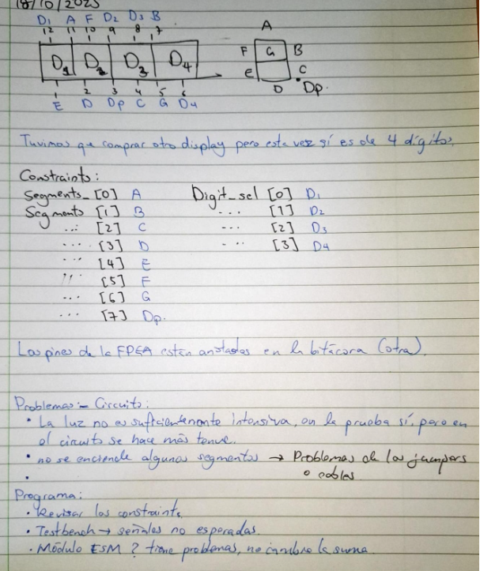

### Ximena Araya Brenes   

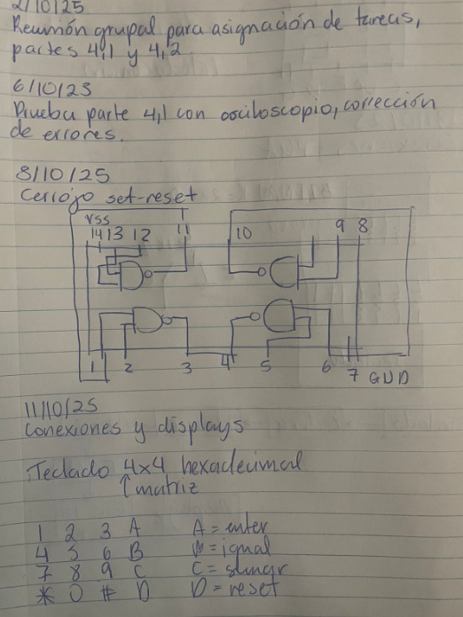

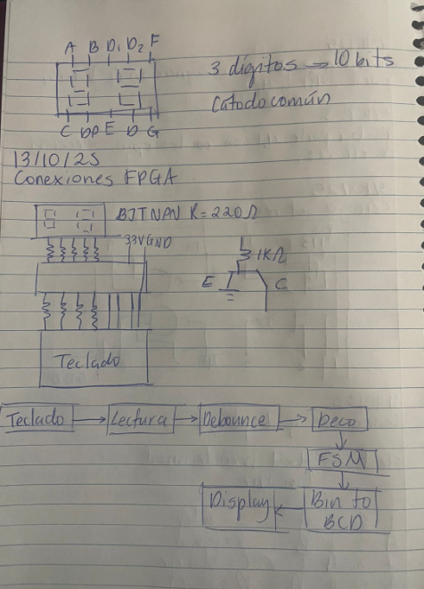

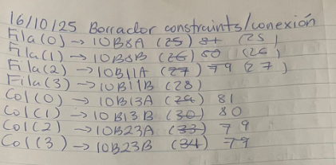

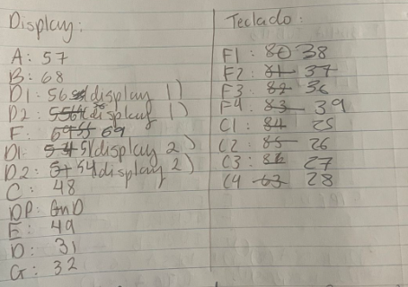

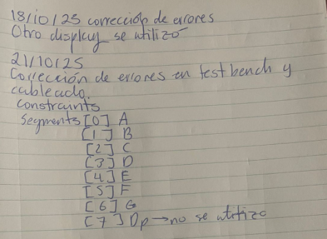
